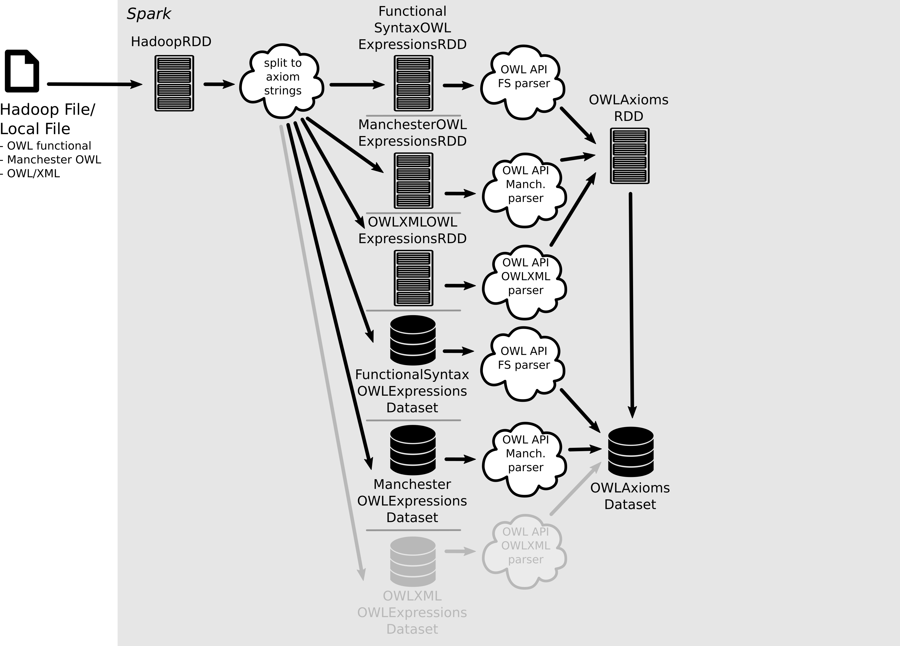
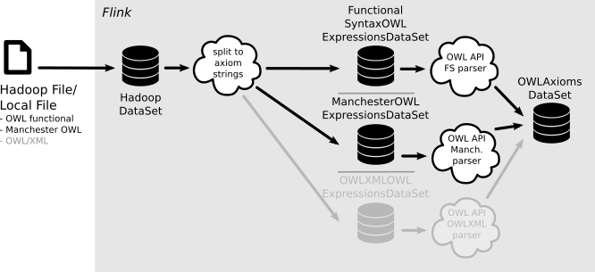

# SANSA OWL
[](https://maven-badges.herokuapp.com/maven-central/net.sansa-stack/sansa-owl-parent_2.11)
[](https://ci.aksw.org/jenkins/job/SANSA%20OWL%20Layer/job/develop/)
## Description
SANSA OWL is a library to read OWL files into [Spark](https://spark.apache.org) or [Flink](https://flink.apache.org). It allows files to reside in HDFS as well as in a local file system and distributes them across Spark RDDs/Datasets or Flink DataSets.

## Package Structure

The package contains three modules:

- `sansa-owl-common` which contains platform-independent, mostly parsing specific functionality
- `sansa-owl-spark` which contains Spark-specific code
- `sansa-owl-flink` which contains Flink-specific code

### SANSA OWL Spark


SANSA OWL Spark mainly contains builder objects to read OWL files in different formats. Currently we support [Functional Syntax](https://www.w3.org/TR/owl2-syntax/) and [Manchester Syntax](https://www.w3.org/TR/owl2-manchester-syntax/). Parsing support for [OWL XML](https://www.w3.org/TR/owl-xmlsyntax/) is planned for future releases. Besides this we also work on building OWL axioms from other RDF formats like [Turtle](https://www.w3.org/TR/turtle/) or [N-Triples](https://www.w3.org/TR/n-triples/).

We support distributed representations of OWL files based on [RDDs](http://spark.apache.org/docs/latest/programming-guide.html#resilient-distributed-datasets-rdds) or [Spark datasets](http://spark.apache.org/docs/latest/sql-programming-guide.html#datasets-and-dataframes). These can either contain string-based representations of single entities of the given format, e.g. single functional-style axiom descriptions like `DisjointDataProperties(bar:dataProp1 bar:dataProp2)` or whole Manchester Syntax frames like
```
ObjectProperty: bar:prop

    Characteristics:
        Asymmetric

```
or parsed [OWL API](http://owlapi.sourceforge.net/) axiom objects. We call these intermediate string-based entities 'expressions' and the corresponding distributed data structures 'expressions RDDs' or 'expressions datasets'. The final data structures holding OWL API axiom objects are called 'axiom RDDs' and 'axiom datasets', respectively.

### SANSA OWL Flink


SANSA OWL Flink mainly contains builder objects to read OWL files in different formats. Currently we support [Functional Syntax](https://www.w3.org/TR/owl2-syntax/) and [Manchester Syntax](https://www.w3.org/TR/owl2-manchester-syntax/). Parsing support for [OWL XML](https://www.w3.org/TR/owl-xmlsyntax/) is planned for future releases. Besides this we also work on building OWL axioms from other RDF formats like [Turtle](https://www.w3.org/TR/turtle/) or [N-Triples](https://www.w3.org/TR/n-triples/).

Distributed representations can either contain string-based representations of single entities of the given format, e.g. single functional-style axiom descriptions like `DisjointDataProperties(bar:dataProp1 bar:dataProp2)` or whole Manchester Syntax frames like
```
ObjectProperty: bar:prop

    Characteristics:
        Asymmetric

```
or parsed [OWL API](http://owlapi.sourceforge.net/) axiom objects. We call these intermediate string-based entities 'expressions' and the corresponding distributed data structure 'expressions dataset'. The final data structure holding OWL API axiom objects is called 'axiom dataset'.

## Usage

The following Scala code shows how to read an OWL file in Functional Syntax (be it a local file or a file residing in HDFS) into a Spark dataset:
```scala
val dataset = FunctionalSyntaxOWLAxiomsDatasetBuilder.build(sparkSession, "path/to/functional/syntax/file.owl")
```
We also provide builder objects for the other described OWL formats and data structures. The same holds for the Flink implementations. An overview is given in the [FAQ section of the SANSA project page](http://sansa-stack.net/faq/#owl-processing). Further documentation about the builder objects can also be found on the [ScalaDoc page](http://sansa-stack.net/scaladocs/).
